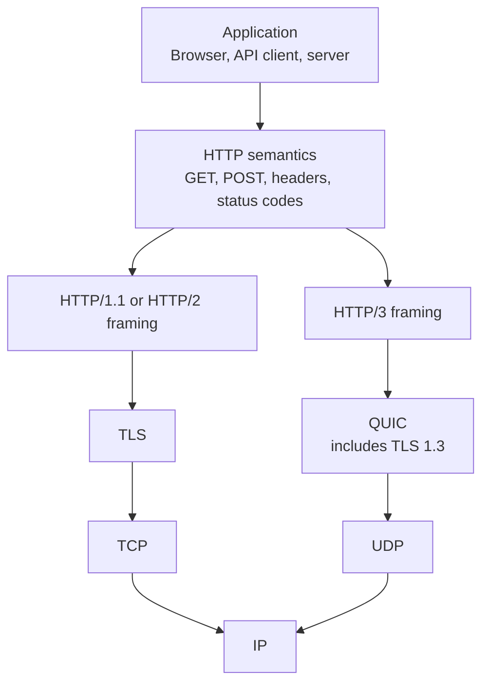
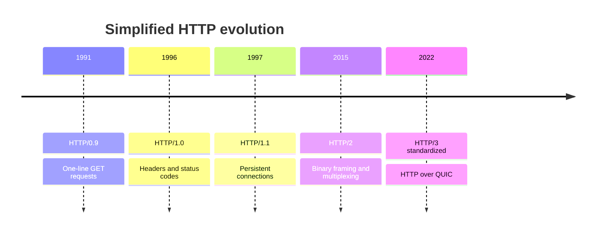
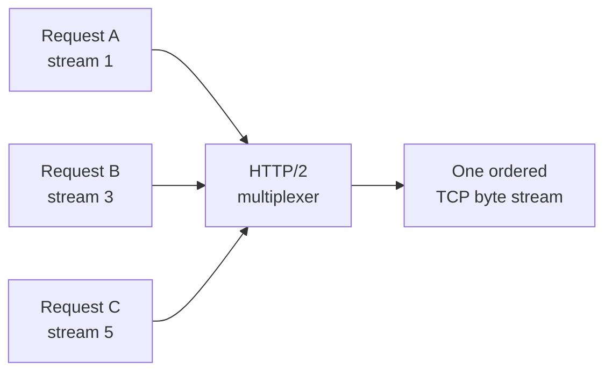
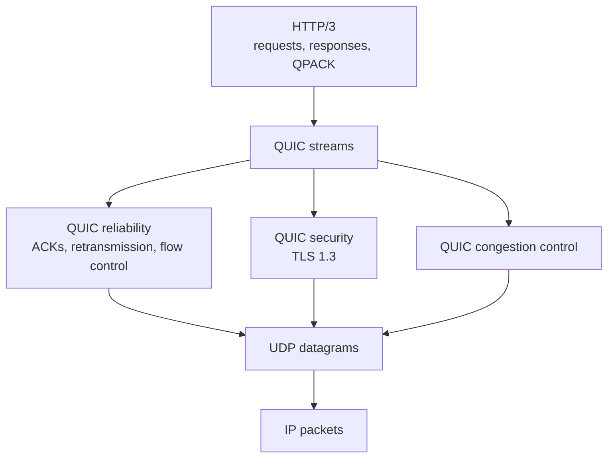
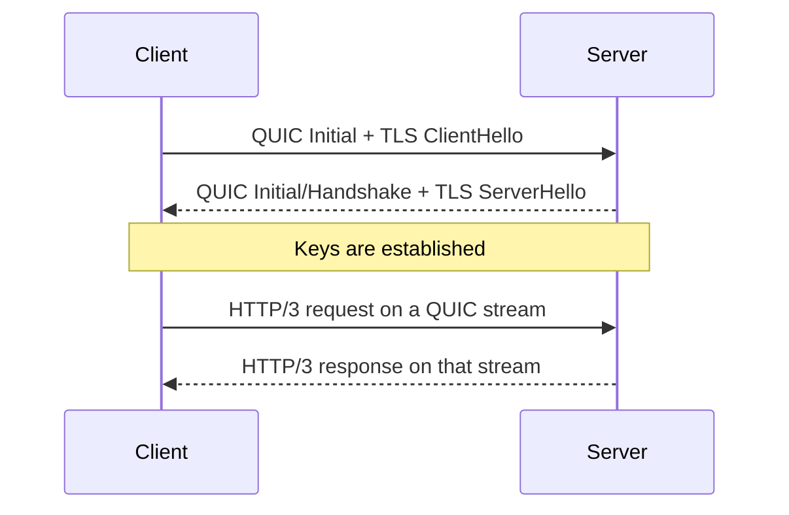
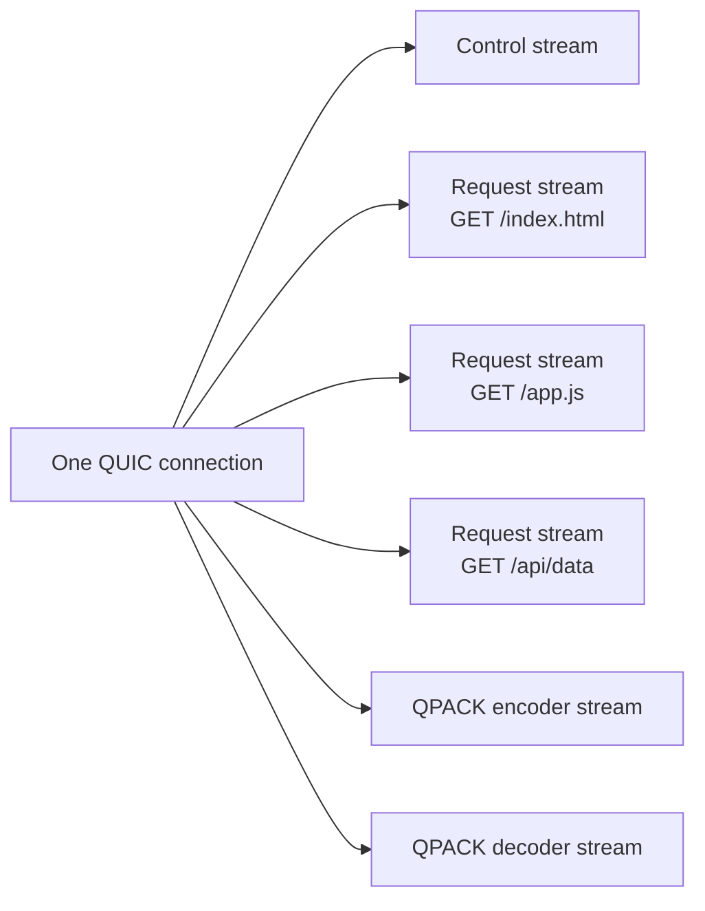
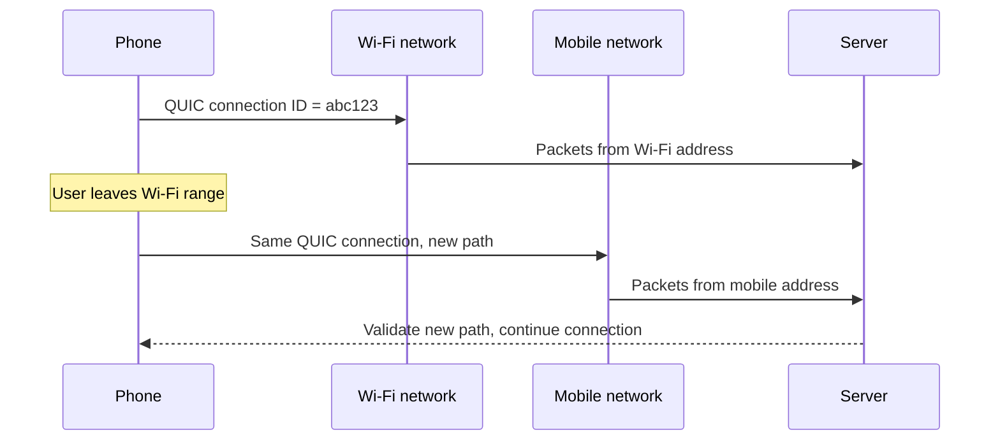
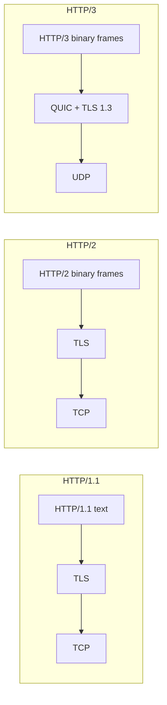
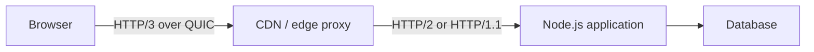

# HTTP/3: From HTTP/1.1 to QUIC

A practical, developer-friendly guide to what HTTP/3 is, why it exists, how it works, and when it helps.

> **Short version:** HTTP/3 keeps normal HTTP semantics but replaces the TCP transport used by HTTP/1.1 and HTTP/2 with QUIC, a secure transport built on UDP. Its biggest benefit is better behavior when packets are lost, especially when many requests share one connection.

## Learning Goals

After reading this guide, you should be able to:

- Explain the difference between HTTP semantics, framing, and transport.
- Compare HTTP/1.1, HTTP/2, and HTTP/3.
- Describe TCP and QUIC head-of-line blocking.
- Explain QUIC streams, TLS 1.3, connection IDs, and connection migration.
- Identify situations where HTTP/3 helps and where it may not.
- Check whether a real website supports HTTP/3.

## Table of Contents

1. [Start with the big picture](#1-start-with-the-big-picture)
2. [How HTTP evolved](#2-how-http-evolved)
3. [HTTP/1.1: multiple TCP connections](#3-http11-multiple-tcp-connections)
4. [HTTP/2: multiplexing over one TCP connection](#4-http2-multiplexing-over-one-tcp-connection)
5. [The problem HTTP/3 targets](#5-the-problem-http3-targets)
6. [QUIC: the transport under HTTP/3](#6-quic-the-transport-under-http3)
7. [How an HTTP/3 request works](#7-how-an-http3-request-works)
8. [Important HTTP/3 concepts](#8-important-http3-concepts)
9. [Version comparison](#9-version-comparison)
10. [Performance: when HTTP/3 wins](#10-performance-when-http3-wins)
11. [Deployment and fallback](#11-deployment-and-fallback)
12. [Hands-on experiments](#12-hands-on-experiments)
13. [Common misconceptions](#13-common-misconceptions)
14. [Knowledge check](#14-knowledge-check)
15. [Glossary and references](#15-glossary-and-references)

---

## 1. Start with the Big Picture

When you open a website, several protocols work together. HTTP defines messages such as requests, responses, methods, headers, and status codes. A transport protocol moves those messages between machines.



The application-level meaning stays mostly the same:

```http
GET /products/42 HTTP/1.1
Host: example.com
Accept: application/json
```

```http
HTTP/1.1 200 OK
Content-Type: application/json

{"id":42,"name":"Keyboard"}
```

HTTP/2 and HTTP/3 encode this information as binary frames rather than sending exactly this readable text, but your application still thinks in terms of `GET`, `200`, headers, and bodies.

### The key separation

| Concern | Question it answers | Examples |
|---|---|---|
| HTTP semantics | What does this message mean? | `GET`, `POST`, `404`, headers |
| HTTP framing | How is the message represented on the connection? | Text in HTTP/1.1; binary frames in HTTP/2 and HTTP/3 |
| Transport | How do bytes reliably cross the network? | TCP or QUIC |
| Network | How are packets routed between hosts? | IP |

This separation explains why an Express route usually does not change when a reverse proxy adds HTTP/3 support. The edge proxy handles HTTP/3 and forwards an ordinary HTTP request to the Node.js application.

---

## 2. How HTTP Evolved



| Version | Main improvement | Important limitation |
|---|---|---|
| HTTP/0.9 | Very simple document retrieval | Only basic `GET`; no headers or status codes |
| HTTP/1.0 | Methods, headers, status codes, more content types | Usually one request per TCP connection |
| HTTP/1.1 | Persistent connections, chunked transfer, better caching | Requests on one connection are effectively ordered |
| HTTP/2 | Multiplexed streams, binary frames, HPACK compression | A lost TCP packet can pause every HTTP stream |
| HTTP/3 | Multiplexed QUIC streams, QPACK, connection migration | More infrastructure complexity; UDP may be blocked |

Each version keeps the core HTTP model. HTTP/3 does not replace URLs, methods, status codes, cookies, caching, or REST.

---

## 3. HTTP/1.1: Multiple TCP Connections

HTTP/1.1 can reuse a connection, but a connection cannot freely interleave several responses. Pipelining exists in the specification, but browsers generally avoided it because one delayed response could hold up later responses.

Browsers therefore commonly open several TCP connections to the same origin:

```text
Connection 1:  GET index.html  ===== response =====>
Connection 2:  GET app.js      ========== response =========>
Connection 3:  GET styles.css  === response ===>
Connection 4:  GET logo.png    ======= response =======>
Connection 5:  GET avatar.jpg  ===== response =====>
Connection 6:  GET data.json   ============ response ============>
```

This creates parallelism, but each connection has costs:

- A separate TCP handshake.
- A separate TLS handshake for HTTPS.
- Separate congestion-control state.
- More sockets and server resources.

### HTTP/1.1 application head-of-line blocking

Imagine three requests sharing one persistent connection:

```text
Request order:   A --------> B --> C -->
Response order:  [ A is slow................ ][ B ][ C ]
                                                   ^
                           B and C wait behind A --+
```

This is **head-of-line blocking**: work at the front of a line delays independent work behind it.

---

## 4. HTTP/2: Multiplexing over One TCP Connection

HTTP/2 breaks requests and responses into binary frames. Each request/response exchange uses a logical **stream**, and frames from many streams can be interleaved on one TCP connection.



On the wire, frames can be mixed:

```text
TCP byte stream:
[A1][B1][C1][A2][C2][B2][A3]...
```

Advantages over HTTP/1.1 include:

- Many concurrent HTTP streams on one connection.
- HPACK header compression.
- Fewer TCP and TLS handshakes.
- Binary framing with explicit stream IDs.

HTTP/2 solves HTTP/1.1's application-level ordering problem, but it still depends on TCP's single ordered byte stream.

---

## 5. The Problem HTTP/3 Targets

### TCP guarantees ordering

TCP gives the application one reliable, ordered stream of bytes. If a TCP segment is lost, later bytes may already have reached the receiver, but TCP does not expose them to HTTP/2 until the missing bytes are retransmitted.

Suppose packet `P2` contains data for HTTP/2 stream B and is lost:

```text
Sent:       [P1: stream A] [P2: stream B] [P3: stream C] [P4: stream A]
                              X lost

Received:   [P1: stream A]                  [P3: stream C] [P4: stream A]
                                               |              |
                                               +------wait----+

Delivered to HTTP/2:
            [P1] ... pause until P2 is retransmitted ... [P2][P3][P4]
```

Streams A and C are logically independent at the HTTP/2 layer, but TCP does not know that. It only sees one ordered byte stream.

This is **transport-level head-of-line blocking**.

### QUIC keeps stream ordering separate

QUIC understands independent streams. Loss on one stream normally blocks only that stream:

```text
QUIC stream A: [A1] [A2] [A3] ---------------> continues
QUIC stream B: [B1] [B2 lost] ... wait ... B2 -> blocked
QUIC stream C: [C1] [C2] [C3] ---------------> continues
```

Important nuance: all streams still share network capacity and congestion control. Heavy packet loss can reduce the whole connection's sending rate, but unrelated streams do not have to wait for one missing stream's bytes to be reordered.

---

## 6. QUIC: The Transport Under HTTP/3

QUIC is a secure, reliable, multiplexed transport protocol. It is commonly implemented in user space and sends its packets inside UDP datagrams.



### “UDP is unreliable, so how can HTTP/3 be reliable?”

UDP itself provides only datagrams, ports, and a checksum. QUIC builds the needed transport features above UDP:

| Feature | TCP | UDP alone | QUIC over UDP |
|---|---:|---:|---:|
| Delivery acknowledgements | Yes | No | Yes |
| Lost-data retransmission | Yes | No | Yes |
| Ordered data | One ordered byte stream | No | Ordered within each stream |
| Flow control | Yes | No | Yes, per stream and connection |
| Congestion control | Yes | No | Yes |
| Encryption built into protocol | No | No | Yes, TLS 1.3 |
| Multiple independent streams | No | No | Yes |

QUIC does not choose unreliability for ordinary HTTP data. It rebuilds reliability in a way that understands independent streams.

### Why build on UDP?

Deploying a brand-new IP transport protocol is difficult because operating systems, routers, NAT devices, and firewalls may not recognize it. UDP is already widely supported, so QUIC can evolve in user-space software while using UDP as its network envelope.

This also means QUIC can often be updated with an application or library instead of waiting for operating-system TCP changes.

---

## 7. How an HTTP/3 Request Works

### First connection

QUIC combines transport setup with TLS 1.3 negotiation. A simplified first connection looks like this:



Compare the conceptual setup cost:

```text
HTTPS with HTTP/2 over TCP (new connection, TLS 1.3)

Client                 Server
  |---- TCP SYN --------->|  \
  |<--- SYN + ACK --------|   } about 1 RTT for TCP
  |---- ACK ------------->|  /
  |---- TLS ClientHello -->|  \
  |<--- TLS ServerHello ---|   } about 1 RTT for TLS
  |---- HTTP request ----->|  /


HTTP/3 over QUIC (new connection)

Client                 Server
  |---- QUIC Initial ----->|  \
  |<--- QUIC Handshake ----|   } transport + TLS together
  |---- HTTP request ----->|  /
```

The exact timing depends on the network, implementation, certificate, and whether the client has connected before. Treat RTT counts as a mental model, not a guaranteed benchmark.

### Returning connection and 0-RTT

After a previous connection, a client may resume a session and send selected application data immediately using **0-RTT**.

```text
Client                                      Server
  |---- QUIC Initial + early request --------->|
  |<--- handshake + response ------------------|
```

0-RTT data can be replayed by an attacker. Servers should not allow unsafe, non-idempotent operations such as “charge this credit card” to depend on 0-RTT replay protection alone. Implementations can reject early data and ask the client to resend it after the handshake.

---

## 8. Important HTTP/3 Concepts

### 8.1 QUIC streams

A QUIC connection can contain many streams. Streams may be:

- **Bidirectional:** both sides can send; HTTP requests normally use client-initiated bidirectional streams.
- **Unidirectional:** one side sends; HTTP/3 uses these for control information and QPACK state.

Each stream has its own ordered byte sequence. Ordering is not imposed between different streams.



### 8.2 Frames, packets, and datagrams

These terms are related but not interchangeable:

```text
HTTP/3 frame
  inside a QUIC STREAM frame
    inside a QUIC packet
      inside a UDP datagram
        inside an IP packet
          inside an Ethernet/Wi-Fi frame
```

- An **HTTP/3 frame** carries an HTTP concern such as headers or body data.
- A **QUIC frame** carries stream data, acknowledgements, flow-control updates, and other transport information.
- A **QUIC packet** contains one or more QUIC frames and is protected by encryption.
- A **UDP datagram** carries QUIC packets through the network.

QUIC retransmits lost information, not necessarily the exact same packet. For example, lost stream data may be placed into a new QUIC packet with a new packet number.

### 8.3 TLS 1.3 is built in

HTTP/3 does not have a plaintext mode equivalent to ordinary `http://` over TCP. QUIC integrates TLS 1.3 so that almost all transport metadata and all HTTP data are encrypted.

Benefits include:

- Confidentiality: observers cannot read the HTTP content.
- Integrity: modification is detected.
- Authentication: the client can verify the server certificate.
- Faster coordination between connection and cryptographic handshakes.

Some information must remain visible for packets to be routed, such as source and destination IP addresses and UDP ports. Encryption does not make the connection invisible.

### 8.4 Connection IDs and migration

TCP identifies a connection with source IP, source port, destination IP, and destination port. If a phone changes from Wi-Fi to mobile data, its IP address changes and a TCP connection normally breaks.

QUIC uses **connection IDs** that can allow the same logical connection to survive a network-path change.



Migration is a capability, not a promise that every application or network change will be seamless. The endpoint validates the new path, and policy or timeouts can still end a connection.

### 8.5 QPACK header compression

Headers repeat frequently:

```http
user-agent: ...
accept: application/json
cache-control: no-cache
cookie: ...
```

Sending every header as full text wastes bandwidth.

- HTTP/1.1 has no built-in stateful header compression.
- HTTP/2 uses **HPACK**.
- HTTP/3 uses **QPACK**, designed for QUIC's independently delivered streams.

QPACK uses static and dynamic tables to represent repeated headers with compact references. Its design controls how much a request stream can be blocked while waiting for a dynamic-table entry delivered on another stream.

### 8.6 Flow control versus congestion control

These solve different problems:

| Mechanism | Protects | Main question |
|---|---|---|
| Flow control | Receiver | “Can the receiver buffer and process more data?” |
| Congestion control | Network | “Can the path carry more data without overload?” |

QUIC has connection-level and stream-level flow control. A receiver can limit one stream without necessarily stopping every other stream.

### 8.7 Loss recovery

QUIC packet numbers always increase and are not reused when data is retransmitted. This makes acknowledgement and loss reasoning less ambiguous than TCP sequence-number behavior in some situations.

QUIC acknowledges received packets with ACK frames. When data is considered lost, the sender transmits the needed information again in new frames and packets.

---

## 9. Version Comparison

### Architecture



### Feature matrix

| Feature | HTTP/1.1 | HTTP/2 | HTTP/3 |
|---|---|---|---|
| Standard transport | TCP | TCP | QUIC over UDP |
| Common security | Optional TLS | Usually TLS in browsers | TLS 1.3 integrated and required |
| Wire representation | Text-based messages | Binary frames | Binary frames |
| Concurrent streams per connection | Effectively limited | Yes | Yes |
| Header compression | No built-in stateful compression | HPACK | QPACK |
| Transport loss blocks unrelated HTTP streams | Per TCP connection | Yes | Normally no |
| Connection migration | No | No | Supported by QUIC |
| New-connection setup | TCP, then optional TLS | TCP, then TLS | QUIC and TLS coordinated |
| Typical port for HTTPS | TCP 443 | TCP 443 | UDP 443 |
| Browser fallback available | N/A | Usually HTTP/1.1 | Usually HTTP/2 or HTTP/1.1 |

### What does not change

The following usually remain the same across versions:

- URLs such as `https://example.com/products/42`.
- Methods such as `GET`, `POST`, `PUT`, and `DELETE`.
- Status codes such as `200`, `404`, and `500`.
- Headers, cookies, caching rules, and content negotiation.
- Application frameworks and route handlers.

Your server framework may report a protocol version differently, but the business logic should not need an “HTTP/3 route.”

---

## 10. Performance: When HTTP/3 Wins

HTTP/3 is not automatically faster for every request.

### Strong conditions for HTTP/3

- Mobile users moving between Wi-Fi and cellular networks.
- Networks with packet loss, jitter, or long round-trip times.
- Pages loading many resources concurrently.
- Long-lived connections where network paths may change.
- Users far from the server, especially when a CDN terminates QUIC nearby.

### Conditions with a smaller benefit

- A fast, stable, low-latency local network.
- A response dominated by slow database or application work.
- One large transfer where multiplexing is not important.
- A connection that is already warm and loss-free.
- Servers or clients with inefficient QUIC implementations.

### Latency budget example

Suppose an API request takes 230 ms:

```text
DNS lookup          20 ms   ████
Connection setup    60 ms   ████████████
Network travel      40 ms   ████████
Server processing  100 ms   ████████████████████
Body transfer       10 ms   ██
                   ------
Total              230 ms
```

Improving connection setup from 60 ms to 30 ms saves 30 ms, but optimizing the 100 ms server operation may matter more. Always measure the complete system.

### A useful mental model

```text
HTTP/1.1: solve concurrency with several roads
HTTP/2:   put many lanes on one road, but one TCP roadblock can stop all lanes
HTTP/3:   keep many lanes, while loss recovery is aware of each lane
```

The road analogy is imperfect because congestion control and bandwidth are still shared, but it captures the head-of-line difference.

---

## 11. Deployment and Fallback

Most teams enable HTTP/3 at a CDN, cloud load balancer, or reverse proxy rather than implementing QUIC in each application service.



The user gets HTTP/3 on the internet-facing connection, while the internal service can continue using its existing HTTP stack.

### How a client discovers HTTP/3

A common flow is:

1. The client connects using HTTP/2 or HTTP/1.1.
2. The server sends an `Alt-Svc` response header advertising HTTP/3.
3. The client remembers the advertisement and tries QUIC on a later request.
4. If QUIC fails, the client falls back to HTTP/2 or HTTP/1.1.

Example advertisement:

```http
Alt-Svc: h3=":443"; ma=86400
```

HTTPS DNS records can also advertise supported protocols, depending on client and DNS support.

### Network requirements

- Allow inbound and outbound UDP on the HTTP/3 port, normally `443`.
- Keep TCP `443` available for HTTP/2 and HTTP/1.1 fallback.
- Ensure the TLS certificate covers the advertised origin.
- Configure load balancers to understand QUIC rather than treating it as arbitrary UDP.
- Monitor success rate, fallback rate, handshake time, packet loss, and CPU usage.

### Why fallback matters

Some enterprise firewalls, VPNs, NAT devices, or networks block or degrade UDP. A production website should not require HTTP/3 as its only path. Browsers generally race, retry, or fall back, but the server must continue offering a TCP-based HTTP version.

---

## 12. Hands-On Experiments

### Experiment 1: Check `curl` support

Not every `curl` build includes HTTP/3. Check yours:

```bash
curl --version
```

Look for `HTTP3` in the `Features` line. If it is present, request an HTTP/3-capable endpoint:

```bash
curl --http3 -I https://cloudflare-quic.com/
```

Require HTTP/3 and fail instead of falling back:

```bash
curl --http3-only -I https://cloudflare-quic.com/
```

Use verbose output to inspect connection negotiation:

```bash
curl --http3 -v https://cloudflare-quic.com/
```

Public test endpoints can change. If this host is unavailable, use any known HTTP/3-enabled site.

### Experiment 2: Use browser developer tools

In a Chromium-based browser:

1. Open Developer Tools.
2. Select the **Network** tab.
3. Right-click the table header and enable **Protocol**.
4. Reload the page.
5. Look for `h3`, `h2`, or `http/1.1`.

Browsers may reuse an existing connection or learn HTTP/3 through `Alt-Svc`, so a first load and a later load can show different protocols.

### Experiment 3: Inspect advertisements

```bash
curl -I https://example.com
```

Search the response headers for something like:

```http
alt-svc: h3=":443"; ma=86400
```

An advertisement says HTTP/3 is available; it does not prove the current request used HTTP/3.

### Experiment 4: Capture QUIC traffic

On macOS, first identify the active interface if needed, then capture UDP port 443:

```bash
sudo tcpdump -i en0 -n udp port 443
```

You will see UDP packets, but HTTP content is encrypted. Wireshark can identify QUIC structures and, with suitable session keys from a controlled client, decrypt supported captures.

### Experiment 5: Compare carefully

If your `curl` supports each version:

```bash
curl --http1.1 -sS -o /dev/null \
  -w 'HTTP/1.1 connect=%{time_connect} start=%{time_starttransfer} total=%{time_total}\n' \
  https://example.com/

curl --http2 -sS -o /dev/null \
  -w 'HTTP/2 connect=%{time_connect} start=%{time_starttransfer} total=%{time_total}\n' \
  https://example.com/

curl --http3 -sS -o /dev/null \
  -w 'HTTP/3 connect=%{time_connect} start=%{time_starttransfer} total=%{time_total}\n' \
  https://example.com/
```

Run each command multiple times. Results can be affected by DNS caching, TLS resumption, QUIC resumption, server load, CDN location, connection reuse, and network variation. One run is not a benchmark.

### Suggested deeper lab

Use a network emulator to test the same page under several conditions:

| Test | RTT | Packet loss | Expected observation |
|---|---:|---:|---|
| Local-quality path | 10 ms | 0% | Versions may perform similarly |
| Distant stable path | 100 ms | 0% | Setup and reuse become more visible |
| Distant lossy path | 100 ms | 2% | HTTP/3 stream independence may help |
| Mobile-like path | Variable | Variable | QUIC migration and loss recovery matter more |

Measure page completion time, largest contentful paint, handshake duration, retransmissions, and fallback rate rather than only one API response.

---

## 13. Common Misconceptions

### “HTTP/3 is HTTP over unreliable UDP”

Incomplete. QUIC uses UDP as an envelope but provides acknowledgements, retransmission, flow control, congestion control, encryption, and ordered delivery within streams.

### “UDP means packets are always faster”

No. UDP has a smaller basic contract, but QUIC still performs substantial reliability and security work. Performance depends on implementation, network, workload, and connection state.

### “HTTP/3 completely removes head-of-line blocking”

It removes TCP head-of-line blocking **between independent QUIC streams**. Data within one stream is still ordered, and congestion or shared bottlenecks can affect the complete connection.

### “HTTP/3 replaces REST or WebSockets”

No. HTTP/3 is a protocol version and transport change. REST is an architectural style. WebSocket is a separate bidirectional protocol; other technologies such as WebTransport are designed to use HTTP/3 capabilities more directly.

### “My Node.js route must be rewritten for HTTP/3”

Usually no. A CDN or reverse proxy often terminates HTTP/3 and forwards HTTP/2 or HTTP/1.1 internally. Application semantics stay the same.

### “If a response has `Alt-Svc`, this request used HTTP/3”

No. `Alt-Svc` advertises an alternative service for future or parallel connection attempts. Check browser protocol columns or client verbose output to determine the protocol actually used.

### “HTTP/3 is always faster than HTTP/2”

No. On a clean, low-latency path, the difference can be small or an implementation may make HTTP/3 slower. Its advantages become clearer under loss, latency, mobility, and concurrent stream load.

---

## 14. Knowledge Check

Try answering before opening the solutions.

1. What changes between HTTP/2 and HTTP/3: HTTP semantics, framing, transport, or all three?
2. Why can one lost TCP packet delay several HTTP/2 streams?
3. Why does using UDP not make HTTP/3 application data unreliable?
4. What does a QUIC connection ID make possible?
5. What is the difference between flow control and congestion control?
6. Why should a production service keep TCP port 443 available?
7. Why can 0-RTT be dangerous for non-idempotent requests?

<details>
<summary>Show answers</summary>

1. HTTP semantics remain mostly the same. HTTP/3 has its own framing mapped to QUIC, and the transport changes from TCP to QUIC over UDP.
2. TCP exposes one ordered byte stream. It holds later bytes until missing earlier bytes are recovered, even if those bytes belong to independent HTTP/2 streams.
3. QUIC implements reliability, acknowledgements, retransmission, flow control, and congestion control above UDP.
4. It allows endpoints to identify a connection independently of one fixed IP-address-and-port path, enabling connection migration.
5. Flow control protects a receiver from too much data; congestion control protects the network path from too much traffic.
6. UDP can be blocked or degraded. TCP 443 provides HTTP/2 or HTTP/1.1 fallback.
7. An attacker may replay 0-RTT data. Repeating an unsafe operation could cause duplicate side effects.

</details>

### Explain it in one minute

A solid short explanation is:

> HTTP/1.1 often uses several TCP connections for concurrency. HTTP/2 multiplexes many request streams over one TCP connection, but packet loss in TCP can temporarily block all of those streams. HTTP/3 maps HTTP onto QUIC, a secure transport built over UDP. QUIC provides reliability per stream, integrates TLS 1.3, supports faster setup and connection migration, and prevents loss on one stream from directly blocking unrelated streams. HTTP methods and application behavior remain mostly unchanged.

---

## 15. Glossary and References

### Glossary

| Term | Meaning |
|---|---|
| ACK | Acknowledgement that packets or data arrived |
| ALPN | TLS mechanism for negotiating an application protocol such as `h2` or `h3` |
| Congestion control | Adjusts sending rate to avoid overloading the network |
| Connection migration | Moving a live QUIC connection to a new network path |
| Flow control | Prevents a sender from overwhelming a receiver |
| Frame | A structured unit inside HTTP/2, HTTP/3, or QUIC |
| Head-of-line blocking | Earlier delayed data prevents later independent work from progressing |
| HPACK | HTTP/2 header compression |
| Multiplexing | Interleaving several logical streams on one connection |
| QPACK | HTTP/3 header compression |
| QUIC | Secure, reliable, multiplexed transport built over UDP |
| RTT | Round-trip time: time for data to travel to a peer and back |
| Stream | Independent ordered sequence of bytes within a multiplexed connection |
| TLS | Protocol providing encryption, integrity, and authentication |
| UDP | Datagram transport used as QUIC's network envelope |

### Standards

- [RFC 9114: HTTP/3](https://www.rfc-editor.org/rfc/rfc9114)
- [RFC 9000: QUIC Transport Protocol](https://www.rfc-editor.org/rfc/rfc9000)
- [RFC 9001: Using TLS to Secure QUIC](https://www.rfc-editor.org/rfc/rfc9001)
- [RFC 9002: QUIC Loss Detection and Congestion Control](https://www.rfc-editor.org/rfc/rfc9002)
- [RFC 9204: QPACK](https://www.rfc-editor.org/rfc/rfc9204)
- [RFC 9113: HTTP/2](https://www.rfc-editor.org/rfc/rfc9113)
- [RFC 9112: HTTP/1.1](https://www.rfc-editor.org/rfc/rfc9112)

## Final Mental Model

```text
HTTP/1.1
  HTTP messages -> one-at-a-time behavior per TCP connection

HTTP/2
  HTTP streams  -> binary multiplexing -> one TCP byte stream
                                            ^
                                            loss can pause all streams

HTTP/3
  HTTP streams  -> independent QUIC streams -> UDP -> IP
                         ^
                         loss recovery understands stream boundaries
```

The most important idea is not simply “HTTP/3 uses UDP.” It is that **QUIC moves secure transport, multiplexing, and loss recovery into one protocol that understands independent streams**.
